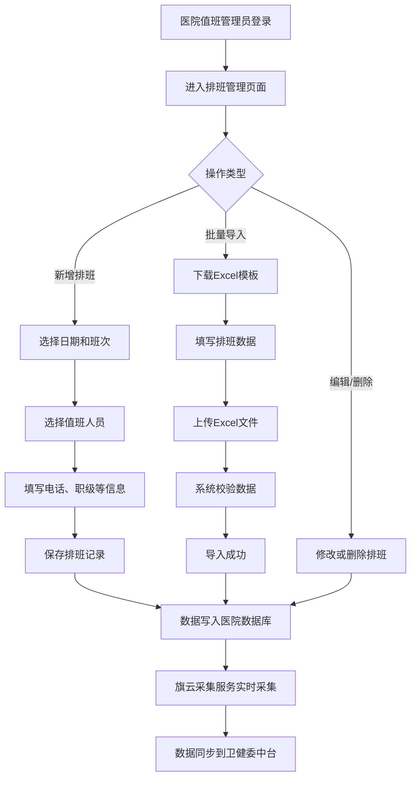
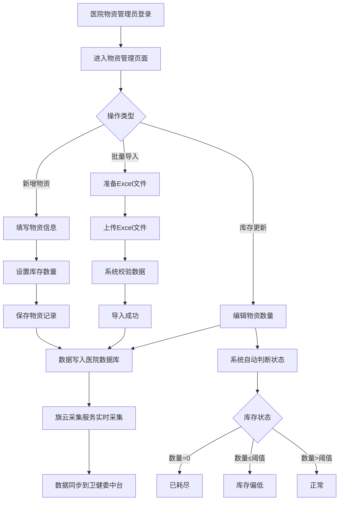
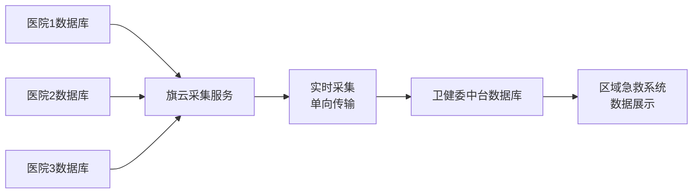

# 宝安区域急救应急物资及值班管理系统

# 需求规格说明书（SRS）

**文档编号：** SRS-HDEMS-2026-001

**文档版本：** 1.0.0

**编写日期：** 2026年1月20日

**作者：** 林艺伟

**审核状态：** 草稿

---

## 文档修订历史

| 版本号 | 修订日期 | 修订人 | 修订内容 | 审核人 |
|--------|----------|--------|----------|--------|
| 1.0.0 | 2026-01-20 | 林艺伟 | 初始版本创建 | - |

---

## 目录

1. [引言](#1-引言)
2. [项目概述](#2-项目概述)
3. [功能性需求](#3-功能性需求)
4. [非功能性需求](#4-非功能性需求)
5. [数据需求](#5-数据需求)
6. [接口需求](#6-接口需求)
7. [系统架构与部署](#7-系统架构与部署)
8. [安全需求](#8-安全需求)
9. [质量属性](#9-质量属性)
10. [验收标准](#10-验收标准)
11. [附录](#11-附录)

---

## 1. 引言

### 1.1 编写目的

本需求规格说明书旨在详细描述"宝安区域急救应急物资及值班管理系统"的完整功能需求、非功能需求、系统约束和验收标准，为系统设计、开发、测试和验收提供明确的依据。

**阅读对象：**
- 系统架构师和技术负责人
- 软件开发工程师
- 测试工程师
- 项目经理
- 卫健委和医院相关业务人员
- 系统运维人员

### 1.2 项目背景

#### 1.2.1 业务背景

宝安区区域急救项目是提升区域急救能力的重要信息化建设项目。该项目的核心目标是建立统一的区域急救信息平台，实现急救资源的统一调度和管理。

#### 1.2.2 当前存在的问题

1. **数据上报方式落后**
   - 各家医院目前通过Excel表格手动上报值班信息和物资库存信息
   - Excel格式不统一，数据质量难以保证
   - 上报周期不稳定，数据时效性差

2. **数据无法自动采集**
   - 区域急救中台系统无法实时获取各医院的值班数据
   - 应急物资库存数据无法自动同步到中台
   - 数据孤岛现象严重，影响急救决策效率

3. **项目验收受阻**
   - 区域急救项目因缺少值班和物资数据展示功能，无法通过验收
   - 急需建立数据采集和管理机制

#### 1.2.3 项目目标

**总体目标：**
建设"应急物资及值班管理系统"，实现各医院值班信息和物资库存信息的数字化管理，通过旗云中台服务自动采集数据到卫健委中台数据库，支撑区域急救项目的验收和日常运营。

**具体目标：**
- 统一各医院的数据上报格式，规范数据标准
- 实现值班信息和物资库存信息的在线管理
- 支持Excel批量导入导出，降低使用门槛
- 通过数据采集服务实现数据自动同步（单向、实时）
- 支撑区域急救项目按期验收

### 1.3 项目范围

#### 1.3.1 包含范围

**功能范围：**
1. **物资管理系统**
   - 物资信息的增删改查
   - 物资库存状态管理（正常/偏低/耗尽/过期）
   - Excel批量导入导出（最多5000条）
   - 物资搜索和多条件筛选
   - 库存阈值配置管理
   - 物资过期提醒功能

2. **值班管理系统**
   - 局级行政排班管理
   - 院级行政排班管理
   - 院内专家排班管理
   - 排班一览表（跨类型汇总查询）
   - 支持排班补录（允许补录过去日期）

3. **系统管理**
   - 用户管理（4种固定角色 + 组织层级组合权限）
   - 基础数据管理（人员信息、科室信息、班次信息、物资类型等）
   - 医院信息管理
   - 库存阈值配置

**业务范围：**
- 覆盖宝安区所有参与区域急救项目的医院
- 支持每家医院独立部署，数据物理隔离
- 数据采集到卫健委中台，支持跨院查询

#### 1.3.2 不包含范围

- 急救车辆的调度管理
- 急救病例的记录和管理
- 医疗设备的管理
- 人员考勤系统
- 财务结算功能
- 移动端APP开发（仅支持Web浏览器访问）

### 1.4 术语和缩略语

| 术语/缩略语 | 全称/定义 | 说明 |
|------------|-----------|------|
| SRS | Software Requirements Specification | 软件需求规格说明书 |
| JWT | JSON Web Token | 用于身份验证的令牌 |
| CSV | Comma-Separated Values | 逗号分隔值文件格式 |
| Excel | Microsoft Excel | 微软电子表格软件，支持.xlsx和.xls格式 |
| HTTP | HyperText Transfer Protocol | 超文本传输协议 |
| HTTPS | HTTP Secure | 安全的超文本传输协议 |
| API | Application Programming Interface | 应用程序编程接口 |
| UI | User Interface | 用户界面 |
| UE | User Experience | 用户体验 |
| RDBMS | Relational Database Management System | 关系型数据库管理系统 |
| VPN | Virtual Private Network | 虚拟专用网络 |
| HDEMS | Hospital Duty and Emergency Materials System | 医院值班与应急物资管理系统 |

### 1.5 参考资料

1. 《软件需求规格说明书模板》GB/T 9385-2008
2. 《Web应用安全开发规范》
3. Ant Design Vue 官方文档：https://antdv.com/
4. ASP.NET Core 官方文档：https://learn.microsoft.com/zh-cn/aspnet/core/
5. FreeSQL 官方文档：https://freesql.net/
6. Vue.js官方文档：https://cn.vuejs.org/

---

## 2. 项目概述

### 2.1 项目目标（SMART原则）

| 目标维度 | 具体描述 |
|----------|----------|
| **S**pecific（具体的） | 开发一个Web管理系统，支持值班信息和物资库存信息的在线管理、Excel导入导出、数据自动采集到中台 |
| **M**easurable（可衡量的） | 支持10家医院部署，每家医院管理不超过2000条排班记录和2000条物资记录，数据采集延迟≤30秒 |
| **A**chievable（可实现的） | 采用成熟的技术栈（C#/.NET 10 + ASP.NET + FreeSQL + Vue.js + Ant Design Vue），使用旗云现有中台采集服务 |
| **R**elevant（相关的） | 直接解决区域急救项目无法展示值班和物资数据的问题，推进项目验收 |
| **T**ime-bound（有时限的） | 项目周期3个月，2026年Q2完成上线 |

### 2.2 用户角色及权限

#### 2.2.1 角色定义

| 角色名称 | 角色描述 | 主要职责 |
|----------|----------|----------|
| **系统管理员** | 系统最高权限管理者 | 用户管理、角色分配、系统配置、数据备份、查看本院所有数据 |
| **值班管理员** | 值班管理员（支持卫健委/医院两级） | 卫健委值班管理员：在卫健委系统中管理局级行政排班<br/>医院值班管理员：在医院系统中管理本院的行政排班和专家排班 |
| **物资管理员** | 物资管理员 | 在医院系统中管理本院的物资库存信息 |

**权限机制说明：**
- 系统采用**3种固定角色 + 组织层级**的组合权限设计
- 值班管理员通过**所属组织（卫健委/医院）+ 角色类型**确定具体权限
- 例如：卫健委值班管理员在卫健委系统中工作，医院值班管理员在医院系统中工作，两者数据物理隔离
- **重要说明**：
  - 卫健委系统：仅部署在卫健委端，管理局级行政排班，通过数据采集服务汇总各医院数据
  - 医院系统：各医院独立部署，管理本院的行政排班、专家排班和物资库存，数据自动同步到卫健委中台

#### 2.2.2 角色权限矩阵

**医院系统权限矩阵**（各医院独立部署）：

| 功能模块 | 系统管理员 | 值班管理员 | 物资管理员 |
|----------|-----------|-----------|---------------|
| **用户管理** | ✅完全控制 | ❌ | ❌ |
| **基础数据管理** | ✅完全控制 | ✅查看/编辑 | ❌ |
| **库存阈值配置** | ✅完全控制 | ❌ | ❌ |
| **院级行政排班** | ✅完全控制 | ✅完全控制 | ❌ |
| **院内专家排班** | ✅完全控制 | ✅完全控制 | ❌ |
| **排班一览表** | ✅查看本院 | ✅查看本院 | ❌ |
| **物资管理** | ✅完全控制 | ❌ | ✅完全控制 |

**卫健委系统权限矩阵**（卫健委端独立部署）：

| 功能模块 | 系统管理员 | 值班管理员 |
|----------|-----------|-----------|
| **用户管理** | ✅完全控制 | ❌ |
| **基础数据管理** | ✅完全控制 | ✅查看/编辑 |
| **局级行政排班** | ✅完全控制 | ✅完全控制 |
| **排班一览表** | ✅查看全部（含汇总数据） | ✅查看全部（含汇总数据） |

### 2.3 业务流程

#### 2.3.1 医院端值班管理流程



#### 2.3.2 医院端物资管理流程



#### 2.3.3 数据采集与汇总流程



### 2.4 用户使用场景

#### 场景1：医院值班管理员录入排班

**角色：** 医院值班管理员
**场景：** 每月20日，A医院值班管理员小张需要为下个月安排行政值班

**操作步骤：**
1. 登录系统，进入"院级行政排班"页面
2. 点击"新增排班"按钮
3. 选择下个月的排班日期（如2026-02-01）
4. 选择医院：第一人民医院
5. 选择班次：早班
6. 选择值班人员：从下拉列表选择"张三"
7. 系统自动填充：职务（主任医师）、科室（内科）、电话（13800138000）
8. 点击"保存"按钮
9. 系统提示"排班信息保存成功"

**预期结果：**
- 排班记录保存成功
- 30秒内，数据自动同步到卫健委中台
- 卫健委值班管理员可在卫健委系统的"排班一览表"中查看该条记录（数据已通过采集服务汇总）

---

#### 场景2：医院物资管理员导入物资数据

**角色：** 医院物资管理员
**场景：** 月底盘点物资，需要批量更新库存数量

**操作步骤：**
1. 登录系统，进入"物资管理"页面
2. 点击"导出Excel"按钮，下载当前物资清单
3. 在Excel中更新库存数量
4. 点击"导入Excel"按钮
5. 选择更新后的Excel文件
6. 系统校验文件格式和数据（最多1000条）
7. 校验通过后，提示"成功导入150条记录"
8. 系统自动更新库存状态：
   - 库存=0的物资标记为"已耗尽"（红色）
   - 库存≤2的物资标记为"库存偏低"（黄色）
   - 库存>2的物资标记为"正常"（绿色）

**预期结果：**
- 物资库存批量更新成功
- 库存状态自动更新
- 数据实时同步到卫健委中台
- 系统管理员可查看库存预警物资

---

#### 场景3：卫健委值班管理员查看排班总览

**角色：** 卫健委值班管理员
**场景：** 周一早晨，在卫健委系统中查看本周所有医院的值班安排（数据已通过采集服务汇总到中台）

**操作步骤：**
1. 登录卫健委系统，进入"排班一览表"页面
2. 设置筛选条件：
   - 日期范围：2026-01-22 至 2026-01-28
   - 医院名称：全部医院（数据已从各医院采集到中台）
   - 排班类型：全部类型
3. 点击"查询"按钮
4. 查看统计卡片：
   - 总排班人数：248人
   - 局级排班人数：56人（在卫健委系统录入）
   - 院级排班人数：124人（从各医院采集）
   - 主任排班人数：68人（从各医院采集）
5. 浏览详细排班列表
6. 点击"导出Excel"，导出报表存档

**预期结果：**
- 看到所有医院本周的排班安排（局级排班来自卫健委系统，院级和主任排班来自各医院系统采集）
- 可按医院、科室、排班类型等维度查看
- 支持导出Excel用于工作汇报

---

## 3. 功能性需求

### 3.1 系统管理模块

#### 3.1.1 FR-SYS-001 系统初始化

**需求编号：** FR-SYS-001
**需求名称：** 系统初始化
**优先级：** 高
**用户角色：** 系统管理员

**需求描述：**
系统首次启动时自动生成一个唯一的初始化密钥（key），用于创建管理员账号和后续密码重置验证。

**功能说明：**
1. 系统首次启动时，自动生成32位随机密钥
2. 密钥显示在系统初始化页面，提示管理员妥善保管
3. 管理员使用密钥完成首次管理员账号创建
4. 密钥仅用于管理员密码重置验证，不得用于其他用途
5. 密钥创建后存储在数据库加密字段中

**验收标准：**
- 首次启动自动生成密钥
- 密钥格式：32位十六进制字符串（如：a1b2c3d4e5f6...）
- 密钥仅显示一次，后续可查看但不可修改
- 使用密钥可成功重置管理员密码

---

#### 3.1.2 FR-SYS-002 用户登录

**需求编号：** FR-SYS-002
**需求名称：** 用户登录
**优先级：** 高
**用户角色：** 所有用户

**需求描述：**
用户使用账号和密码登录系统，系统验证身份后发放JWT Token进行权限管理。

**输入：**
- 账号/工号（字符串，必填）
- 密码（字符串，必填，加密传输）

**处理逻辑：**
1. 用户输入账号和密码
2. 前端对密码进行SHA256加密
3. 发送登录请求到后端
4. 后端验证账号密码：
   - 账号是否存在
   - 密码是否正确
   - 账号是否被禁用
5. 验证成功后，生成JWT Token（有效期：8小时）
6. 返回Token和用户基本信息（角色、姓名、科室等）
7. 前端存储Token到localStorage
8. 跳转到系统主页面

**输出：**
- 登录成功：JWT Token + 用户信息
- 登录失败：错误提示（账号不存在、密码错误、账号已禁用）

**验收标准：**
- 支持账号密码登录
- 密码错误5次后锁定账号30分钟
- JWT Token有效期8小时，过期后自动跳转登录页
- 登录失败提示明确的错误信息

---

#### 3.1.3 FR-SYS-003 用户管理

**需求编号：** FR-SYS-003
**需求名称：** 用户管理
**优先级：** 高
**用户角色：** 系统管理员

**需求描述：**
系统管理员对用户账号进行增删改查和密码重置操作。

**业务字段：**
| 字段名称 | 数据类型 | 约束 | 说明 |
|----------|----------|------|------|
| 用户ID | 字符串 | 主键 | 系统自动生成雪花ID |
| 账号/工号 | 字符串 | 必填，唯一 | 长度6-20字符，支持字母数字下划线 |
| 姓名 | 字符串 | 必填 | 长度2-20字符 |
| 手机号码 | 字符串 | 必填 | 11位手机号 |
| 科室 | 字符串 | 可选 | 所属科室名称 |
| 角色 | 数组 | 必填 | 用户角色，可多选 |
| 状态 | 枚举 | 必填 | 启用/禁用，默认启用 |
| 创建时间 | 日期时间 | 自动 | 账号创建时间 |
| 最后登录时间 | 日期时间 | 自动 | 最后一次登录时间 |

**功能列表：**
1. **新增用户**
   - 输入用户基本信息
   - 设置初始密码（默认：123456）
   - 分配角色（可多选）

2. **编辑用户**
   - 修改姓名、手机号、科室
   - 调整角色分配
   - 启用/禁用账号

3. **删除用户**
   - 二次确认提示
   - 删除前检查是否有关联数据
   - 软删除，保留历史记录

4. **重置密码**
   - 使用系统初始化密钥验证
   - 重置为新密码（如：123456）
   - 记录密码重置日志

5. **用户列表查询**
   - 支持按账号、姓名、科室搜索
   - 支持按角色筛选
   - 支持按状态筛选

**验收标准：**
- 账号全局唯一，重复时提示错误
- 密码重置需输入初始化密钥验证
- 用户删除前检查关联数据
- 所有操作记录到系统日志

---

#### 3.1.4 FR-SYS-004 基础数据管理

**需求编号：** FR-SYS-004
**需求名称：** 基础数据管理
**优先级：** 中
**用户角色：** 系统管理员、值班管理员

**需求描述：**
管理系统的基础数据字典，包括人员信息、科室信息、班次信息、人员职级、物资类型等。

**数据字典列表：**

1. **人员信息**
   - 姓名
   - 职务
   - 职级
   - 科室
   - 联系电话

2. **科室信息**
   - 科室编码
   - 科室名称
   - 科室类型（临床/医技/行政）

3. **班次信息**
   - 班次编码
   - 班次名称（早班、中班、晚班、夜班、全天）
   - 时间段（可选）

4. **人员职级**
   - 职级编码
   - 职级名称
   - 职级分类（局级、院级、行政）

5. **物资类型**
   - 类型编码
   - 类型名称（食品类、医疗用品、救援设备、衣物类、其他）

**功能要求：**
- 所有基础数据支持增删改查
- 数据删除前检查是否被使用
- 支持Excel导入导出
- 系统预置常用数据，可自定义扩展

**验收标准：**
- 数据编码唯一
- 删除前检查引用关系
- 导入数据格式校验
- 操作记录日志

---

#### 3.1.5 FR-SYS-005 库存阈值配置

**需求编号：** FR-SYS-005
**需求名称：** 库存阈值配置
**优先级：** 中
**用户角色：** 系统管理员

**需求描述：**
系统管理员可按物资类型配置库存预警阈值,系统根据阈值自动判断物资库存状态。

**业务字段：**
| 字段名称 | 数据类型 | 约束 | 说明 |
|----------|----------|------|------|
| 配置ID | 字符串 | 主键 | 系统自动生成雪花ID |
| 物资类型 | 枚举 | 必填，唯一 | 食品类/医疗用品/救援设备/衣物类/其他 |
| 预警阈值 | 数值 | 必填 | 最小库存数量，低于此值标记为"库存偏低" |
| 启用状态 | 枚举 | 必填 | 启用/禁用 |
| 创建时间 | 日期时间 | 自动 | 记录创建时间 |
| 更新时间 | 日期时间 | 自动 | 记录最后更新时间 |
| 操作人 | 字符串 | 自动 | 最后操作人 |

**功能列表：**

1. **查看阈值配置**
   - 列表展示所有物资类型的阈值配置
   - 显示当前库存状态为"偏低"的物资数量
   - 支持按启用状态筛选

2. **编辑阈值配置**
   - 点击"编辑"按钮修改阈值
   - 阈值必须 ≥ 0
   - 保存后立即生效
   - 已存在的物资库存状态自动重新计算

3. **启用/禁用配置**
   - 支持临时禁用某个物资类型的阈值检查
   - 禁用后该类型物资不进行库存偏低判断

4. **批量重置**
   - 支持一键恢复所有阈值为默认值
   - 需二次确认

**默认配置：**
| 物资类型 | 默认阈值 | 说明 |
|----------|---------|------|
| 食品类 | 10 | 应急食品、饮用水等 |
| 医疗用品 | 2 | 急救包、药品等 |
| 救援设备 | 5 | 手电筒、收音机等 |
| 衣物类 | 10 | 毛毯、衣物等 |
| 其他 | 5 | 其他应急物资 |

**验收标准：**
- 阈值修改后库存状态立即更新
- 支持动态调整所有物资类型的阈值
- 操作记录日志

---

### 3.2 物资管理模块

#### 3.2.1 FR-MAT-001 物资信息管理

**需求编号：** FR-MAT-001
**需求名称：** 物资信息管理
**优先级：** 高
**用户角色：** 物资管理员

**需求描述：**
对医院的应急物资进行全生命周期管理，包括物资的新增、编辑、删除、查看和库存管理。

**业务字段：**
| 字段名称 | 数据类型 | 约束 | 说明 |
|----------|----------|------|------|
| 物资ID | 字符串 | 主键 | 系统自动生成雪花ID |
| 物资编号 | 字符串 | 必填，唯一 | 人工编码或系统生成 |
| 物资名称 | 字符串 | 必填 | 最长50字符 |
| 物资类型 | 枚举 | 必填 | 食品类/医疗用品/救援设备/衣物类/其他 |
| 物资规格 | 字符串 | 可选 | 最长100字符 |
| 库存数量 | 数值 | 必填 | ≥0，支持2位小数 |
| 单位 | 字符串 | 可选 | 个、箱、件、台等 |
| 生产日期 | 日期 | 可选 | 格式：YYYY/MM/DD |
| 质保期（月） | 数值 | 可选 | 质保期月数 |
| 过期日期 | 日期 | 自动 | 生产日期 + 质保期，系统自动计算 |
| 存放位置 | 字符串 | 必填 | 所在位置 |
| 所在医院 | 字符串 | 必填 | 所属医院名称 |
| 备注 | 文本 | 可选 | 最长500字符 |
| 库存状态 | 枚举 | 自动 | 正常/库存偏低/已耗尽/已过期 |
| 更新时间 | 日期时间 | 自动 | 最后更新时间 |
| 操作人 | 字符串 | 自动 | 最后操作人 |

**功能列表：**

1. **新增物资**
   - 点击"新增物资"按钮打开表单
   - 填写物资基本信息（名称、类型、物资规格）
   - 填写库存信息（数量、单位、存放位置）
   - 填写生产信息（生产日期、质保期）
   - 系统自动生成物资编号（雪花ID）
   - 系统自动计算过期日期
   - 保存后自动判断库存状态和过期状态

2. **编辑物资**
   - 点击"编辑"按钮打开表单
   - 表单预填当前物资信息
   - 修改库存数量后自动更新库存状态
   - 修改生产日期或质保期后自动重新计算过期日期
   - 保存后记录操作日志

3. **删除物资**
   - 点击"删除"按钮
   - 弹出确认对话框："您确定要删除该物资吗？此操作不可撤销"
   - 确认后软删除物资
   - 记录删除日志

4. **查看详情**
   - 点击"查看详情"按钮
   - 以只读方式展示物资完整信息
   - 显示物资的变更历史记录

5. **过期提醒**
   - 系统每天凌晨自动检查物资过期状态
   - 过期状态判断：当前日期 > 生产日期 + 质保期
   - 提前30天预警：物资即将过期时标记为"即将过期"（橙色）
   - 已过期：标记为"已过期"（灰色）
   - 在物资列表顶部显示过期和即将过期物资统计卡片
   - 支持按过期状态筛选

**库存状态判断规则：**
- 已耗尽（红色）：库存数量 = 0
- 库存偏低（黄色）：库存数量 ≤ 该物资类型对应的预设阈值
- 正常（绿色）：库存数量 > 预设阈值
- 已过期（灰色）：当前日期 > 生产日期 + 质保期

**阈值配置说明：**
系统支持按物资类型动态配置库存预警阈值，默认配置如下：
- 食品类：阈值 = 10
- 医疗用品：阈值 = 2
- 救援设备：阈值 = 5
- 衣物类：阈值 = 10
- 其他：阈值 = 5

系统管理员可通过"库存阈值配置"模块调整各物资类型的阈值。

**验收标准：**
- 物资编号唯一
- 库存数量不能为负数
- 库存状态自动更新
- 所有操作记录日志
- 删除前检查是否被引用

---

#### 3.2.2 FR-MAT-002 物资查询与筛选

**需求编号：** FR-MAT-002
**需求名称：** 物资查询与筛选
**优先级：** 高
**用户角色：** 物资管理员、系统管理员

**需求描述：**
支持多条件组合查询和筛选物资信息，快速定位目标物资。

**查询方式：**
1. **关键词搜索**
   - 搜索范围：物资名称、物资编号、物资规格
   - 支持模糊匹配
   - 实时搜索，输入即搜索

2. **类型筛选**
   - 按物资类型筛选
   - 选项：全部类型、食品类、医疗用品、救援设备、衣物类、其他

3. **状态筛选**
   - 按库存状态筛选
   - 选项：全部状态、正常、库存偏低、已耗尽

4. **组合筛选**
   - 同时应用多个筛选条件
   - 条件之间为AND关系
   - 支持一键重置所有筛选条件

**输出：**
- 符合条件的物资列表
- 显示筛选结果数量
- 支持导出筛选结果

**验收标准：**
- 搜索响应时间 ≤ 2秒
- 支持模糊匹配
- 筛选条件可组合
- 筛选结果可导出

---

#### 3.2.3 FR-MAT-003 Excel导入导出

**需求编号：** FR-MAT-003
**需求名称：** Excel导入导出
**优先级：** 高
**用户角色：** 物资管理员

**需求描述：**
支持通过Excel批量导入物资信息，以及将物资数据导出为Excel文件。

**Excel导入功能：**
1. **文件格式要求**
   - 支持.xlsx和.xls格式
   - 单次导入最多5000条数据
   - 文件大小 ≤ 10MB

2. **导入模板**
   - 系统提供标准Excel模板下载
   - 模板包含所有必填字段和示例数据
   - 字段顺序：物资编号、物资名称、物资类型、物资规格、库存数量、单位、生产日期、质保期（月）、存放位置、所在医院、备注

3. **数据校验规则**
   - **必填字段校验**：物资编号、物资名称、物资类型、库存数量、单位、存放位置、所在医院
   - **数据格式校验**：
     - 日期格式：YYYY/MM/DD（如2025/8/16）
     - 数值格式：整数或小数（最多2位小数）
   - **唯一性校验**：物资编号唯一
   - **枚举值校验**：物资类型必须在枚举范围内
   - **长度限制校验**：
     - 物资名称 ≤ 50字符
     - 物资规格 ≤ 100字符
     - 备注 ≤ 500字符

4. **导入流程**
   - 点击"导入Excel"按钮
   - 选择本地Excel文件
   - 系统校验文件格式和大小
   - 解析Excel数据并逐条校验
   - 显示校验结果：
     - 成功：显示成功导入的记录数
     - 失败：显示失败记录数、失败原因、错误行号
   - 校验通过后批量插入数据库
   - 记录导入日志（文件名、记录数、成功数、失败数、操作人、操作时间）

**Excel导出功能：**
1. **导出范围**
   - 导出当前筛选条件下的所有物资数据
   - 包含所有字段（除系统内部字段）
   - 支持全部导出或分页导出

2. **导出格式**
   - 文件格式：.xlsx
   - 文件命名：物资清单_医院名称_YYYYMMDD_HHMMSS.xlsx
   - 编码：UTF-8

3. **导出流程**
   - 点击"导出Excel"按钮
   - 系统生成Excel文件
   - 浏览器自动下载文件
   - 记录导出日志

**验收标准：**
- 导入5000条数据耗时 ≤ 30秒
- 导出数据准确无误
- 错误提示明确具体
- 导入导出记录日志

---

### 3.3 值班管理模块

#### 3.3.1 FR-SCH-001 局级行政排班

**需求编号：** FR-SCH-001
**需求名称：** 局级行政排班管理
**优先级：** 高
**用户角色：** 卫健委值班管理员

**需求描述：**
管理局级行政人员的排班信息，支持排班记录的增删改查和Excel导入导出。

**业务字段：**
| 字段名称 | 数据类型 | 约束 | 说明 |
|----------|----------|------|------|
| 排班ID | 字符串 | 主键 | 系统自动生成雪花ID |
| 排班日期 | 日期 | 必填 | 格式：YYYY-MM-DD |
| 医院名称 | 枚举 | 必填 | 下拉选择，预置医院列表 |
| 班次 | 枚举 | 必填 | 早班/中班/晚班/夜班 |
| 人员姓名 | 字符串 | 必填 | 从人员列表选择或手动输入 |
| 电话 | 字符串 | 必填 | 11位手机号或座机号 |
| 人员职级 | 枚举 | 必填 | 局长/副局长/科长/副科长/科员 |
| 科室 | 枚举 | 必填 | 行政部/医务科/护理部/财务部/后勤部 |
| 职称 | 枚举 | 必填 | 主任医师/副主任医师/主治医师/住院医师/实习医师 |
| 备注 | 文本 | 可选 | 最长200字符 |
| 创建时间 | 日期时间 | 自动 | 记录创建时间 |
| 更新时间 | 日期时间 | 自动 | 记录最后更新时间 |
| 操作人 | 字符串 | 自动 | 最后操作人 |

**功能列表：**
1. **新增排班**
   - 点击"新增排班"按钮
   - 填写表单（必填项标记红色星号）
   - 选择人员后自动填充职务、科室、电话
   - 保存后校验数据完整性和唯一性

2. **编辑排班**
   - 点击表格操作列的"编辑"按钮
   - 修改排班信息
   - 保存后记录变更日志

3. **删除排班**
   - 支持单条删除和批量删除
   - 二次确认提示
   - 软删除，保留历史记录

4. **查询筛选**
   - 关键词搜索（人员姓名、备注）
   - 日期范围筛选
   - 医院名称筛选
   - 科室筛选
   - 班次筛选

5. **Excel导入导出**
   - 下载标准模板
   - 批量导入排班数据（最多5000条）
   - 导出排班数据为Excel

**业务规则：**
- 同一医院、同一排班类型、同一天、同一班次、同一人员不允许重复排班
- 允许排班日期早于当前日期（支持补录），补录时自动标记备注为"补录"
- 电话号码必须符合格式要求
- 批量删除前需勾选至少一条记录
- 同一班次允许多人值班

**验收标准：**
- 重复排班时提示错误
- 必填字段为空时阻止提交
- Excel导入数据校验严格
- 所有操作记录日志

---

#### 3.3.2 FR-SCH-002 院级行政排班

**需求编号：** FR-SCH-002
**需求名称：** 院级行政排班管理
**优先级：** 高
**用户角色：** 医院值班管理员

**需求描述：**
管理医院级别的行政排班信息，功能与局级行政排班基本相同。

**业务字段：**
与局级行政排班相同，区别在于：
- 人员职级选项：主任医师/副主任医师/主治医师/住院医师
- 职称选项：教授/副教授/讲师/助教

**功能列表：**
与局级行政排班相同。

**验收标准：**
与局级行政排班相同。

---

#### 3.3.3 FR-SCH-003 院内专家排班

**需求编号：** FR-SCH-003
**需求名称：** 院内专家排班管理
**优先级：** 高
**用户角色：** 医院值班管理员

**需求描述：**
管理院内专家的排班信息，功能与其他排班类型基本相同。

**业务字段：**
| 字段名称 | 数据类型 | 约束 | 说明 |
|----------|----------|------|------|
| 排班ID | 字符串 | 主键 | 系统自动生成雪花ID |
| 排班日期 | 日期 | 必填 | 格式：YYYY-MM-DD |
| 医院名称 | 枚举 | 必填 | 下拉选择，当前登录用户所在医院 |
| 班次 | 枚举 | 必填 | 早班/中班/晚班/夜班 |
| 人员姓名 | 字符串 | 必填 | 主任姓名 |
| 电话 | 字符串 | 必填 | 11位手机号 |
| 人员职级 | 枚举 | 必填 | 主任医师/副主任医师/主治医师/住院医师 |
| 科室 | 枚举 | 必填 | 内科/外科/妇产科/儿科/骨科/眼科等 |
| 职称 | 枚举 | 必填 | 教授/副教授/讲师/助教 |
| 备注 | 文本 | 可选 | 最长200字符 |

**功能列表：**
与其他排班类型相同。

**特殊功能：**
- 支持下载标准Excel模板
- 模板包含示例数据和字段说明
- 导入时自动校验数据格式

**验收标准：**
与其他排班类型相同。

---

#### 3.3.4 FR-SCH-004 排班一览表

**需求编号：** FR-SCH-004
**需求名称：** 排班一览表
**优先级：** 高
**用户角色：** 所有用户

**需求描述：**
集中展示所有类型的排班信息，支持多维度筛选、统计分析和Excel导出。

**系统区分：**
- **医院系统**：仅显示本院的排班数据（院级行政排班、院内专家排班）
- **卫健委系统**：显示所有医院的排班数据（局级行政排班在卫健委系统录入，院级排班和专家排班通过采集服务从各医院汇总）

**核心功能：**

1. **多维度筛选**
   - 日期范围（开始日期-结束日期）
   - 医院名称（下拉选择）
   - 科室（下拉选择）
   - 排班类型（局级行政/院级行政/院内专家）
   - 人员姓名（文本输入，支持模糊搜索）
   - 班次（早班/中班/晚班/夜班/值班）

2. **数据统计卡片**
   - 总排班人数：显示符合条件的排班总人数
   - 局级排班人数：局级行政排班的人数
   - 院级排班人数：院级行政排班的人数
   - 主任排班人数：院内专家排班的人数
   - 统计数据随筛选条件实时更新

3. **排班列表展示**
   - 表格字段：日期、医院名称、科室、排班类型、班次、人员、职级、职称、电话、备注、操作
   - 支持按任意列排序
   - 支持表格横向滚动
   - 表格行hover高亮
   - 分页显示（10/20/50/100条/页）

4. **数据导出**
   - 导出当前筛选条件下的所有排班数据
   - 支持Excel格式
   - 文件命名：排班一览表_YYYYMMDD_HHMMSS.xlsx

5. **打印功能**
   - 点击"打印"按钮触发浏览器打印
   - 打印内容包括筛选条件、统计卡片、排班表格

**权限控制：**

**医院系统：**
- 系统管理员：可查看和编辑本院的排班记录
- 值班管理员：可查看和编辑本院的排班记录
- 物资管理员：无权限

**卫健委系统：**
- 系统管理员：可查看所有医院的排班汇总数据（包括局级、院级、专家排班）
- 值班管理员：可查看所有医院的排班汇总数据（包括局级、院级、专家排班）

**验收标准：**
- 统计数据准确无误
- 筛选功能响应迅速（≤2秒）
- 导出数据完整准确
- 打印格式美观

---

### 3.4 数据采集模块

#### 3.4.1 FR-DAT-001 数据采集服务

**需求编号：** FR-DAT-001
**需求名称：** 数据采集服务
**优先级：** 高
**用户角色：** 系统管理员

**需求描述：**
通过旗云中台采集服务，从各医院数据库实时采集值班和物资数据到卫健委中台数据库。

**采集架构：**
```
医院数据库 → 旗云采集服务（应用层轮询） → 卫健委中台数据库 → 区域急救系统
```

**采集配置：**
1. **采集方式**：应用层轮询（Polling）
   - 采集服务定期从医院数据库读取变更数据
   - 在医院数据库创建标准化视图
   - 视图字段统一规范
   - 采集服务读取视图数据

2. **采集频率**：准实时采集
   - 轮询间隔：30秒/次
   - 基于时间戳增量采集
   - 记录每次采集的最后更新时间
   - 允许秒级延迟（最多30秒）

3. **采集方向**：单向
   - 从医院 → 卫健委
   - 卫健委端不能修改医院数据
   - 如卫健委发现数据错误，通过系统外渠道（电话、邮件、即时通讯工具）通知医院修正

4. **数据同步策略**
   - **最终一致性**：允许短暂延迟（最多30秒）
   - **幂等性**：重复采集不会导致数据重复
   - **断点续传**：网络中断后恢复，不丢失数据

**数据采集流程：**

1. **初始化阶段**
   - 在医院数据库创建采集视图（包含updated_at字段）
   - 配置采集服务连接参数
   - 注册医院信息到卫健委中台
   - 记录初始采集时间戳

2. **数据变更阶段**
   - 用户在医院系统操作（新增/编辑/删除）
   - 数据写入医院数据库
   - updated_at字段自动更新为当前时间戳

3. **数据采集阶段**（每30秒执行一次）
   - 采集服务轮询所有已注册的医院
   - 查询updated_at > last_collection_time的记录
   - 从医院数据库视图读取变更数据
   - 数据格式转换和清洗
   - 推送数据到卫健委中台
   - 更新last_collection_time为最新时间戳

4. **数据写入阶段**
   - 卫健委中台接收数据
   - 数据校验（格式、完整性）
   - 写入中台数据库（UPSERT操作：存在则更新，不存在则插入）
   - 记录采集日志

**数据采集日志：**
- 采集时间（精确到毫秒）
- 数据来源（医院标识）
- 采集的数据类型（值班/物资）
- 采集记录数
- 成功/失败状态
- 失败原因（如失败）

**异常处理机制：**

1. **重试机制**
   - 采集失败自动重试3次
   - 每次间隔10秒
   - 3次仍失败则记录告警

2. **失败告警**
   - 生成告警记录到中台系统
   - 告警信息包含：医院名称、失败时间、失败原因

3. **数据校验**
   - **采集体检验**：
     - 必填字段完整性
     - 字段格式合法性
     - 数据长度限制
   - **采集后校验**：
     - 数据一致性检查
     - 唯一性约束检查

4. **数据修复**
   - 提供手动触发采集功能
   - 支持按日期范围重新采集
   - 采集失败数据可单独重试

**验收标准：**
- 数据采集延迟 ≤ 30秒
- 采集成功率 ≥ 99.9%
- 支持至少20家医院并发轮询采集
- 异常处理机制完善
- 采集日志完整可查

---

## 4. 非功能性需求

### 4.1 性能需求

| 性能指标 | 要求 | 说明 |
|----------|------|------|
| **并发用户数** | ≥10用户 | 同时在线用户数 |
| **响应时间** | ≤2秒 | 页面加载、查询操作 |
| **数据采集延迟** | ≤30秒 | 医院数据变更到中台可见的延迟 |
| **Excel导入性能** | ≤30秒/5000条 | 批量导入5000条数据 |
| **Excel导出性能** | ≤10秒/5000条 | 导出5000条数据 |
| **数据库查询性能** | ≤500ms | 单表查询，带索引 |
| **系统可用性** | ≥99.5% | 月度统计，允许停机时间约3.6小时/月 |

### 4.2 安全需求

#### 4.2.1 身份认证
- 使用JWT Token进行身份验证
- Token有效期：8小时
- 支持Token刷新机制
- 密码传输加密（SHA256）
- 密码复杂度要求：至少8位，包含字母和数字

#### 4.2.2 权限控制
- 基于角色的访问控制（RBAC）
- 按医院数据隔离
- 敏感操作需二次确认（删除、批量操作）
- 操作日志记录（登录、增删改、导入导出）

#### 4.2.3 数据安全
- 数据库密码加密存储
- 敏感字段加密（如密码）
- 定期数据备份（每日自动备份）
- 备份文件保留30天
- 支持数据恢复

#### 4.2.4 通信安全
- 使用HTTPS协议（TLS 1.2+）
- 数据传输加密
- API接口防重放攻击

#### 4.2.5 审计日志
- 记录所有用户操作
- 日志包含：操作人、操作时间、操作类型、操作内容、IP地址
- 日志保留至少1年
- 支持日志查询和导出

### 4.3 可用性需求

#### 4.3.1 系统可用性
- 月度可用性 ≥ 99.5%
- 计划内停机维护需提前通知
- 提供系统状态监控页面

#### 4.3.2 故障恢复
- 系统故障后1小时内响应
- 4小时内恢复服务
- 数据库故障支持主从切换

#### 4.3.3 容错能力
- 采集服务故障不影响医院端正常使用
- 网络中断后支持断点续传
- 关键操作支持重试机制

### 4.4 可维护性需求

#### 4.4.1 代码质量
- 遵循代码规范（C#和Vue.js规范）
- 代码注释覆盖率 ≥ 30%
- 函数复杂度 ≤ 10
- 代码重复率 ≤ 5%

#### 4.4.2 文档要求
- 提供系统部署文档
- 提供用户操作手册
- 提供API接口文档
- 提供数据库设计文档

#### 4.4.3 日志和监控
- 系统运行日志（错误日志、访问日志）
- 日志级别：DEBUG/INFO/WARN/ERROR
- 日志文件按日期滚动
- 提供系统监控Dashboard

### 4.5 兼容性需求

#### 4.5.1 浏览器兼容性
| 浏览器 | 支持版本 |
|--------|----------|
| Chrome | 90+ |
| Edge | 90+ |
| Firefox | 88+ |
| Safari | 14+ |

#### 4.5.2 操作系统兼容性
- Windows Server 2016+
- CentOS 7+
- Ubuntu 18.04+

#### 4.5.3 数据库兼容性
- SQL Server 2017+
- MySQL 8.0+

#### 4.5.4 屏幕分辨率
- 最低支持分辨率：1366×768
- 推荐分辨率：1920×1080

### 4.6 可扩展性需求

#### 4.6.1 功能扩展
- 预留功能模块接口
- 支持新增排班类型
- 支持自定义物资字段

#### 4.6.2 性能扩展
- 支持数据库读写分离
- 支持缓存机制（Redis）
- 支持负载均衡

#### 4.6.3 多院区扩展
- 支持同一医院多个院区
- 支持院区数据隔离和汇总

---

## 5. 数据需求

### 5.1 数据实体

#### 5.1.1 物资实体（Material）

| 字段名 | 类型 | 长度 | 约束 | 说明 |
|--------|------|------|------|------|
| id | VARCHAR | 36 | PK | 雪花ID主键 |
| material_code | VARCHAR | 50 | UNIQUE | 物资编号 |
| material_name | VARCHAR | 50 | NOT NULL | 物资名称 |
| material_type | VARCHAR | 20 | NOT NULL | 物资类型 |
| specification | VARCHAR | 100 | | 物资规格 |
| quantity | DECIMAL | 10,2 | NOT NULL, DEFAULT 0 | 库存数量 |
| unit | VARCHAR | 20 | | 单位 |
| production_date | DATE | | | 生产日期 |
| shelf_life | INT | | | 质保期（月） |
| location | VARCHAR | 100 | NOT NULL | 存放位置 |
| hospital_name | VARCHAR | 100 | NOT NULL | 所在医院 |
| remark | TEXT | | | 备注 |
| status | VARCHAR | 10 | NOT NULL | 库存状态：NORMAL/LOW/OUT |
| hospital_id | VARCHAR | 36 | FK | 医院ID |
| created_by | VARCHAR | 50 | | 创建人 |
| updated_by | VARCHAR | 50 | | 更新人 |
| created_at | DATETIME | | DEFAULT NOW | 创建时间 |
| updated_at | DATETIME | | ON UPDATE NOW | 更新时间 |
| deleted_at | DATETIME | | | 软删除时间 |

#### 5.1.2 排班实体（Schedule）

| 字段名 | 类型 | 长度 | 约束 | 说明 |
|--------|------|------|------|------|
| id | VARCHAR | 36 | PK | 雪花ID主键 |
| schedule_date | DATE | NOT NULL | | 排班日期 |
| hospital_id | VARCHAR | 36 | FK | 医院ID |
| schedule_type | VARCHAR | 20 | NOT NULL | 排班类型：BUREAU/HOSPITAL/DIRECTOR |
| shift_id | VARCHAR | 36 | FK | 班次ID |
| person_id | VARCHAR | 36 | FK | 人员ID |
| person_name | VARCHAR | 50 | NOT NULL | 人员姓名 |
| phone | VARCHAR | 20 | NOT NULL | 联系电话 |
| rank_id | VARCHAR | 36 | FK | 职级ID |
| department_id | VARCHAR | 36 | FK | 科室ID |
| title_id | VARCHAR | 36 | FK | 职称ID |
| remark | VARCHAR | 200 | | 备注 |
| created_by | VARCHAR | 50 | | 创建人 |
| updated_by | VARCHAR | 50 | | 更新人 |
| created_at | DATETIME | | DEFAULT NOW | 创建时间 |
| updated_at | DATETIME | | ON UPDATE NOW | 更新时间 |
| deleted_at | DATETIME | | | 软删除时间 |

#### 5.1.3 用户实体（User）

| 字段名 | 类型 | 长度 | 约束 | 说明 |
|--------|------|------|------|------|
| id | VARCHAR | 36 | PK | 雪花ID主键 |
| username | VARCHAR | 50 | UNIQUE, NOT NULL | 账号/工号 |
| password | VARCHAR | 64 | NOT NULL | 密码（SHA256） |
| real_name | VARCHAR | 50 | NOT NULL | 真实姓名 |
| phone | VARCHAR | 20 | NOT NULL | 手机号码 |
| department | VARCHAR | 100 | | 科室 |
| roles | JSON | | | 角色列表 |
| status | VARCHAR | 10 | NOT NULL, DEFAULT ACTIVE | 状态：ACTIVE/INACTIVE |
| last_login_at | DATETIME | | | 最后登录时间 |
| created_at | DATETIME | | DEFAULT NOW | 创建时间 |
| updated_at | DATETIME | | ON UPDATE NOW | 更新时间 |

### 5.2 数据字典

#### 5.2.1 物资类型字典

| 编码 | 名称 | 阈值 | 说明 |
|------|------|------|------|
| FOOD | 食品类 | 10 | 应急食品、饮用水等 |
| MEDICAL | 医疗用品 | 2 | 急救包、药品等 |
| EQUIPMENT | 救援设备 | 5 | 手电筒、收音机等 |
| CLOTHING | 衣物类 | 10 | 毛毯、衣物等 |
| OTHER | 其他 | 5 | 其他应急物资 |

#### 5.2.2 排班类型字典

| 编码 | 名称 | 说明 |
|------|------|------|
| BUREAU | 局级行政排班 | 卫健局级行政人员值班 |
| HOSPITAL | 院级行政排班 | 医院级行政人员值班 |
| DIRECTOR | 院内专家排班 | 医院主任级别值班 |

#### 5.2.3 班次字典

| 编码 | 名称 | 时间段 |
|------|------|--------|
| MORNING | 早班 | 08:00-12:00 |
| AFTERNOON | 中班 | 12:00-18:00 |
| EVENING | 晚班 | 18:00-24:00 |
| NIGHT | 夜班 | 00:00-08:00 |
| FULLDAY | 全天 | 00:00-24:00 |

### 5.3 数据流

#### 5.3.1 医院端数据流

```
用户操作 → 前端表单验证 → API接口调用 →
后端业务逻辑处理 → 数据校验 → 写入医院数据库 →
触发采集服务 → 同步到卫健委中台 → 返回操作结果
```

#### 5.3.2 数据采集流

```
医院数据库变更 → 触发器检测 → 调用采集服务API →
读取视图数据 → 数据转换 → 推送到卫健委中台 →
数据校验 → 写入中台数据库 → 记录采集日志
```

---

## 6. 接口需求

### 6.1 用户界面

#### 6.1.1 界面设计原则
- 使用Ant Design Vue组件库
- 遵循Vue.js风格指南
- 响应式设计，支持桌面和平板
- 色彩方案：主色调#165DFF（蓝色）
- 字体：系统默认字体

#### 6.1.2 页面布局
- 顶部导航栏：系统Logo、搜索框、用户信息
- 左侧菜单：二级菜单结构
- 主内容区：面包屑导航、页面标题、内容区域
- 底部状态栏：版权信息

#### 6.1.3 交互方式
- 表单提交：前端校验 + 后端校验
- 操作反馈：成功/失败消息提示（Ant Design Vue Message）
- 确认对话框：删除、批量操作等危险操作
- 加载状态：Loading动画
- 分页：支持页码跳转和每页条数选择

### 6.2 硬件接口
- 无特殊硬件接口需求

### 6.3 软件接口

#### 6.3.1 旗云中台采集服务接口

**接口1：触发数据采集**
- **URL**：POST /api/v1/collect/trigger
- **请求参数**：
  ```json
  {
    "hospital_id": "hospital-001",
    "data_type": "schedule",
    "timestamp": "2026-01-20T10:30:00Z"
  }
  ```
- **返回结果**：
  ```json
  {
    "code": 200,
    "message": "采集任务已触发",
    "task_id": "task-123456"
  }
  ```

**接口2：查询采集状态**
- **URL**：GET /api/v1/collect/status/{task_id}
- **返回结果**：
  ```json
  {
    "code": 200,
    "data": {
      "task_id": "task-123456",
      "status": "SUCCESS",
      "record_count": 100,
      "failed_count": 0,
      "start_time": "2026-01-20T10:30:00Z",
      "end_time": "2026-01-20T10:30:03Z"
    }
  }
  ```

#### 6.3.2 系统内部API接口

**用户登录接口**
- **URL**：POST /api/v1/auth/login
- **请求参数**：
  ```json
  {
    "username": "admin",
    "password": "hashed_password"
  }
  ```
- **返回结果**：
  ```json
  {
    "code": 200,
    "data": {
      "token": "eyJhbGciOiJIUzI1NiIs...",
      "user": {
        "id": "user-001",
        "username": "admin",
        "real_name": "管理员",
        "roles": ["ADMIN"],
        "hospital_id": "hospital-001"
      }
    }
  }
  ```

**物资列表查询接口**
- **URL**：GET /api/v1/materials
- **请求参数**：
  - keyword: 搜索关键词
  - type: 物资类型
  - status: 库存状态
  - page: 页码
  - page_size: 每页条数
- **返回结果**：
  ```json
  {
    "code": 200,
    "data": {
      "total": 100,
      "list": [...],
      "page": 1,
      "page_size": 20
    }
  }
  ```

### 6.4 通信接口

#### 6.4.1 网络协议
- 应用层协议：HTTP/1.1、HTTPS
- 数据传输格式：JSON
- 字符编码：UTF-8

#### 6.4.2 数据交换格式
- 请求数据：JSON格式
- 响应数据：JSON格式
- 文件上传：Multipart/form-data
- 文件下载：二进制流

---

## 7. 系统架构与部署

### 7.1 技术架构

#### 7.1.1 技术栈
| 层级 | 技术 | 说明 |
|------|------|------|
| **前端框架** | Vue.js 3+ | UI框架 |
| **UI组件库** | Ant Design Vue 4+ | 企业级UI组件 |
| **状态管理** | Pinia | 状态管理 |
| **HTTP客户端** | Axios | API请求 |
| **构建工具** | Vite 5+ | 前端构建工具 |
| **后端框架** | C# 13+ / .NET 10 | 后端语言 |
| **Web框架** | ASP.NET Core 10+ | Web框架 |
| **ORM框架** | FreeSQL 3+ | 数据库ORM |
| **数据库** | SQL Server 2017+ / MySQL 8.0+ | 关系型数据库 |
| **缓存** | Redis 6+ | 缓存服务（可选） |

#### 7.1.2 系统架构图

```
┌─────────────────────────────────────────────────────────┐
│                       用户层                            │
│  ┌──────────────┐  ┌──────────────┐  ┌──────────────┐  │
│  │  卫健委用户   │  │  医院用户    │  │ 系统管理员   │  │
│  └──────────────┘  └──────────────┘  └──────────────┘  │
└─────────────────────────────────────────────────────────┘
                           │ HTTPS
                           ▼
┌─────────────────────────────────────────────────────────┐
│                    应用层（医院端）                      │
│  ┌────────────────────────────────────────────────────┐ │
│  │              Vue.js 3 + Ant Design Vue             │ │
│  └────────────────────────────────────────────────────┘ │
│  ┌────────────────────────────────────────────────────┐ │
│  │            ASP.NET Core + FreeSQL                  │ │
│  └────────────────────────────────────────────────────┘ │
└─────────────────────────────────────────────────────────┘
                           │
                           ▼
┌─────────────────────────────────────────────────────────┐
│                   数据层（医院端）                       │
│  ┌──────────────┐  ┌──────────────┐  ┌──────────────┐  │
│  │  业务数据库   │  │  采集视图    │  │  操作日志    │  │
│  │ SQL Server/  │  │  (View)      │  │              │  │
│  │   MySQL      │  │              │  │              │  │
│  └──────────────┘  └──────────────┘  └──────────────┘  │
└─────────────────────────────────────────────────────────┘
                           │ 旗云采集服务（单向）
                           ▼
┌─────────────────────────────────────────────────────────┐
│                   卫健委中台数据库                       │
│  ┌──────────────┐  ┌──────────────┐  ┌──────────────┐  │
│  │  排班数据表   │  │  物资数据表  │  │  采集日志    │  │
│  └──────────────┘  └──────────────┘  └──────────────┘  │
└─────────────────────────────────────────────────────────┘
                           │
                           ▼
┌─────────────────────────────────────────────────────────┐
│                  区域急救系统                            │
│              (展示排班和物资数据)                         │
└─────────────────────────────────────────────────────────┘
```

### 7.2 部署架构

#### 7.2.1 部署方式
- **医院端部署**：每家医院独立部署一台服务器
- **数据隔离**：各医院数据库物理隔离，互不影响
- **数据采集**：通过旗云采集服务汇总到卫健委中台

#### 7.2.2 服务器配置要求

**医院服务器配置：**
| 资源 | 最低配置 | 推荐配置 |
|------|----------|----------|
| CPU | 4核 | 8核 |
| 内存 | 8GB | 16GB |
| 硬盘 | 100GB SSD | 200GB SSD |
| 操作系统 | Windows Server 2016+<br/>CentOS 7+<br/>Ubuntu 18.04+ | Windows Server 2019<br/>CentOS 8<br/>Ubuntu 20.04 |
| 网络 | 固定公网IP或VPN<br/>带宽10Mbps | 固定公网IP或VPN<br/>带宽100Mbps |
| 数据库 | SQL Server 2017+<br/>MySQL 8.0+ | SQL Server 2019<br/>MySQL 8.0+ |

**卫健委中台服务器配置：**
| 资源 | 推荐配置 |
|------|----------|
| CPU | 16核+ |
| 内存 | 32GB+ |
| 硬盘 | 500GB SSD |
| 数据库 | SQL Server 2019+ |
| 网络 | 固定公网IP，带宽100Mbps+ |

#### 7.2.3 网络架构

```
┌───────────────────┐
│   互联网/VPN      │
└─────────┬─────────┘
          │
    ┌─────┴─────┐
    │           │
┌───▼───┐  ┌───▼───┐  ┌───▼───┐
│医院1  │  │医院2  │  │医院N  │
└───────┘  └───────┘  └───────┘
    │           │           │
    └───────────┴───────────┘
                │
          旗云采集服务
                │
          ┌─────▼─────┐
          │卫健委中台  │
          │数据库     │
          └───────────┘
                │
          ┌─────▼─────┐
          │区域急救系统│
          └───────────┘
```

### 7.3 系统初始化流程

#### 7.3.1 医院端初始化步骤

1. **安装部署**
   - 部署应用服务器（Windows/Linux）
   - 安装数据库软件（SQL Server/MySQL）
   - 配置网络环境（固定IP或VPN）

2. **系统安装**
   - 上传应用安装包
   - 执行安装脚本
   - 配置数据库连接参数
   - 配置与卫健委中台的通信参数

3. **数据库初始化**
   - 执行数据库初始化SQL脚本
   - 创建表结构和索引
   - 导入基础数据字典
   - 创建数据库视图（用于采集）

4. **医院信息注册**
   - 在卫健委中台系统注册医院基本信息
   - 生成医院唯一标识（hospital_id）
   - 配置医院名称、地址、联系方式

5. **账号创建**
   - 创建系统管理员账号
   - 使用初始化密钥验证
   - 创建其他角色账号

6. **配置采集任务**
   - 启动旗云采集服务
   - 配置采集参数（医院ID、采集频率）
   - 测试数据采集是否正常
   - 确认卫健委端能正常查看数据

7. **培训上线**
   - 对医院管理员进行系统使用培训
   - 试运行1周，收集问题和反馈
   - 正式上线

---

## 8. 安全需求

### 8.1 身份认证与授权

#### 8.1.1 密码策略
- 密码长度：至少8位
- 密码复杂度：包含字母和数字
- 密码有效期：90天（可选，根据实际情况调整）
- 密码历史：不允许使用最近3次使用过的密码
- 初始密码：首次登录强制修改

#### 8.1.2 登录安全
- 登录失败5次后锁定账号30分钟
- 支持管理员手动解锁
- 记录登录失败日志（IP、时间、失败原因）
- 异地登录检测（可选）

#### 8.1.3 会话管理
- JWT Token有效期：8小时
- Token刷新机制：在Token过期前1小时可刷新
- 用户登出时销毁Token
- 支持强制下线（管理员操作）

**Token刷新机制详细说明：**

1. **Token结构**
   ```
   Header: {"alg": "HS256", "typ": "JWT"}
   Payload: {
     "user_id": "user-001",
     "username": "admin",
     "roles": ["ADMIN"],
     "hospital_id": "hospital-001",
     "iat": 1705729200,        // 签发时间
     "exp": 1705758000,        // 过期时间（8小时后）
     "refresh_exp": 1705754400 // 可刷新截止时间（过期前1小时）
   }
   ```

2. **刷新流程**
   - **客户端刷新时机**：
     - Token剩余有效期 < 1小时时，前端自动触发刷新
     - 或收到401错误时触发刷新
   - **刷新接口**：
     - URL: POST /api/v1/auth/refresh
     - 请求头: Authorization: Bearer <current_token>
     - 返回: 新的Token（8小时有效期）
   - **刷新规则**：
     - 仅在Token过期前1小时内可刷新
     - 刷新成功后，旧Token立即失效
     - 每个Token最多刷新1次（防止无限刷新）
     - 刷新失败需重新登录

3. **安全策略**
   - Token存储在localStorage（配合XSS防护）
   - 敏感操作需二次验证
   - 异常登录检测（IP变化、设备变化）
   - 支持管理员强制注销用户Token

### 8.2 数据安全

#### 8.2.1 数据加密
- 密码使用SHA256加密存储
- 敏感字段加密（如手机号、身份证）
- 数据库连接字符串加密
- 配置文件敏感信息加密

#### 8.2.2 数据备份
- **备份策略**：
  - 数据库每日自动备份（凌晨2:00）
  - 备份文件保留30天
  - 重要操作前手动备份
- **备份方式**：
  - 全量备份：每周一次
  - 增量备份：每日一次
  - 备份文件加密存储

#### 8.2.3 数据恢复
- 支持从备份文件恢复数据
- 数据恢复时间目标（RTO）：≤4小时
- 数据恢复点目标（RPO）：≤24小时

### 8.3 系统安全

#### 8.3.1 输入验证
- 所有用户输入进行前端和后端双重校验
- 防止SQL注入攻击（使用参数化查询）
- 防止XSS攻击（对用户输入进行转义）
- 防止CSRF攻击（使用CSRF Token）

#### 8.3.2 API安全
- API接口签名验证（可选）
- API调用频率限制（Rate Limiting）
- API访问日志记录
- 敏感操作二次确认

#### 8.3.3 日志审计
- 记录所有用户操作
- 日志包含：操作人、操作时间、操作类型、操作内容、IP地址
- 日志级别：DEBUG/INFO/WARN/ERROR
- 日志文件按日期滚动
- 支持日志查询和导出

---

## 9. 质量属性

### 9.1 可靠性
- 系统可用性：≥99.5%（月度）
- 数据采集成功率：≥99.9%
- 数据准确性：100%
- 故障恢复时间：≤4小时

### 9.2 效率
- 页面响应时间：≤2秒
- 数据采集延迟：≤5秒
- Excel导入性能：≤10秒/1000条
- 并发用户数：≥10用户

### 9.3 互操作性
- 支持SQL Server和MySQL数据库
- 支持Chrome、Edge、Firefox、Safari浏览器
- 支持Windows和Linux操作系统
- 提供标准API接口（RESTful）

### 9.4 易用性
- 界面简洁美观，符合用户习惯
- 操作流程简单直观
- 提供帮助文档和操作提示
- 错误提示明确友好

### 9.5 可测试性
- 代码模块化，便于单元测试
- 提供测试接口和测试数据
- 支持自动化测试
- 测试覆盖率 ≥ 70%

---

## 10. 验收标准

### 10.1 功能验收标准

#### 10.1.1 物资管理模块
- ✅ 物资新增、编辑、删除功能正常
- ✅ 库存状态自动更新（正常/偏低/耗尽）
- ✅ Excel导入导出功能正常，数据准确无误
- ✅ 搜索筛选功能正常，响应时间≤2秒
- ✅ 支持批量导入最多1000条数据

#### 10.1.2 值班管理模块
- ✅ 三种排班类型（局级/院级/主任）管理功能正常
- ✅ 排班记录的新增、编辑、删除功能正常
- ✅ 排班一览表统计数据准确
- ✅ 多维度筛选功能正常
- ✅ Excel导入导出功能正常

#### 10.1.3 系统管理模块
- ✅ 用户登录功能正常，Token验证有效
- ✅ 用户管理功能正常，角色权限正确
- ✅ 基础数据管理功能正常
- ✅ 系统初始化流程顺畅

#### 10.1.4 数据采集模块
- ✅ 数据自动采集功能正常
- ✅ 数据采集延迟≤5秒
- ✅ 数据采集成功率≥99.9%
- ✅ 异常处理机制完善
- ✅ 采集日志记录完整

### 10.2 性能验收标准

| 性能指标 | 验收标准 | 测试方法 |
|----------|----------|----------|
| 页面响应时间 | ≤2秒 | 性能测试工具 |
| 并发用户数 | ≥10用户 | 负载测试 |
| 数据采集延迟 | ≤5秒 | 端到端测试 |
| Excel导入性能 | ≤10秒/1000条 | 功能测试 |
| 系统可用性 | ≥99.5% | 稳定性测试 |

### 10.3 安全验收标准

| 安全项 | 验收标准 | 测试方法 |
|--------|----------|----------|
| 密码加密 | SHA256加密存储 | 代码审查 |
| SQL注入防护 | 使用参数化查询 | 渗透测试 |
| XSS防护 | 用户输入转义 | 渗透测试 |
| HTTPS通信 | 使用TLS 1.2+ | 网络抓包 |
| 操作日志 | 完整记录用户操作 | 功能测试 |

### 10.4 交付物清单

#### 10.4.1 软件交付物
- ✅ 医院端应用安装包（Windows/Linux版本）
- ✅ 数据库初始化脚本
- ✅ 系统部署文档
- ✅ 系统管理员账号和初始化密钥

#### 10.4.2 文档交付物
- ✅ 需求规格说明书（本文档）
- ✅ 系统设计文档
- ✅ 数据库设计文档
- ✅ API接口文档
- ✅ 用户操作手册
- ✅ 系统运维手册

#### 10.4.3 源代码交付物
- ✅ 前端源代码（Vue.js）
- ✅ 后端源代码（C# / .NET）
- ✅ 数据库脚本（SQL）
- ✅ 部署脚本

---

## 11. 附录

### 11.1 附录A：数据库表结构

#### A.1 物资表（t_material）

```sql
CREATE TABLE t_material (
  id VARCHAR(36) PRIMARY KEY,
  material_code VARCHAR(50) UNIQUE NOT NULL,
  material_name VARCHAR(50) NOT NULL,
  material_type VARCHAR(20) NOT NULL,
  specification VARCHAR(100),
  quantity DECIMAL(10,2) NOT NULL DEFAULT 0,
  unit VARCHAR(20),
  production_date DATE,
  shelf_life INT,
  location VARCHAR(100) NOT NULL,
  hospital_name VARCHAR(100) NOT NULL,
  remark TEXT,
  status VARCHAR(10) NOT NULL,
  hospital_id VARCHAR(36) NOT NULL,
  created_by VARCHAR(50),
  updated_by VARCHAR(50),
  created_at DATETIME DEFAULT CURRENT_TIMESTAMP,
  updated_at DATETIME ON UPDATE CURRENT_TIMESTAMP,
  deleted_at DATETIME,
  INDEX idx_material_type (material_type),
  INDEX idx_status (status),
  INDEX idx_hospital_id (hospital_id)
);
```

#### A.2 排班表（t_schedule）

```sql
CREATE TABLE t_schedule (
  id VARCHAR(36) PRIMARY KEY,
  schedule_date DATE NOT NULL,
  hospital_id VARCHAR(36) NOT NULL,
  schedule_type VARCHAR(20) NOT NULL,
  shift_id VARCHAR(36) NOT NULL,
  person_id VARCHAR(36),
  person_name VARCHAR(50) NOT NULL,
  phone VARCHAR(20) NOT NULL,
  rank_id VARCHAR(36),
  department_id VARCHAR(36),
  title_id VARCHAR(36),
  remark VARCHAR(200),
  created_by VARCHAR(50),
  updated_by VARCHAR(50),
  created_at DATETIME DEFAULT CURRENT_TIMESTAMP,
  updated_at DATETIME ON UPDATE CURRENT_TIMESTAMP,
  deleted_at DATETIME,
  UNIQUE KEY uk_schedule (schedule_date, hospital_id, schedule_type, shift_id, person_id),
  INDEX idx_schedule_date (schedule_date),
  INDEX idx_hospital_id (hospital_id),
  INDEX idx_schedule_type (schedule_type)
);
```

#### A.3 用户表（t_user）

```sql
CREATE TABLE t_user (
  id VARCHAR(36) PRIMARY KEY,
  username VARCHAR(50) UNIQUE NOT NULL,
  password VARCHAR(64) NOT NULL,
  real_name VARCHAR(50) NOT NULL,
  phone VARCHAR(20) NOT NULL,
  department VARCHAR(100),
  roles JSON,
  status VARCHAR(10) NOT NULL DEFAULT 'ACTIVE',
  last_login_at DATETIME,
  created_at DATETIME DEFAULT CURRENT_TIMESTAMP,
  updated_at DATETIME ON UPDATE CURRENT_TIMESTAMP,
  INDEX idx_username (username),
  INDEX idx_status (status)
);
```

### 11.2 附录B：Excel导入模板

#### B.1 物资导入模板

| 物资编号 | 物资名称 | 物资类型 | 物资规格 | 库存数量 | 单位 | 生产日期 | 质保期（月） | 存放位置 | 所在医院 | 备注 |
|----------|----------|----------|----------|----------|------|----------|------------|----------|----------|------|
| EM-2023001 | 急救包（标准型） | 医疗用品 | | 120 | 个 | 2025/8/16 | 12 | 松岗人民医院 | 松岗人民医院 | |
| EM-2023002 | 强光手电筒 | 救援设备 | | 85 | 个 | 2025/5/5 | 36 | 石岩人民医院 | 石岩人民医院 | |

#### B.2 排班导入模板

**模板结构说明：**

排班导入模板采用分区结构设计,包含**业务设置**（左侧）和**数据逻辑**（右侧）两个主要部分,支持三种不同的排班类型。

**数据表映射说明：**

所有三种排班类型最终映射到同一张数据库表 `t_schedule`，通过 `schedule_type` 字段区分：
- 区域级行政值班：`schedule_type = 'BUREAU'`
- 医院级行政值班：`schedule_type = 'HOSPITAL'`
- 医院级专家值班：`schedule_type = 'DIRECTOR'`

不同排班类型的字段差异：
- **区域级行政值班**：不包含"科室"和"职称"字段（对应的数据库字段 `department_id` 和 `title_id` 为NULL）
- **医院级行政值班**和**医院级专家值班**：包含完整字段，包括"科室"和"职称"

---

---

**区1：区域级行政值班**

**业务设置：**
- 业务区类：区域级行政值班
- 主要业务：单人, 卫健助理
- 填报人员：（留空）

**数据逻辑字段：**

| 日期 | 医院 | 班次 | 人员 | 电话 | 角色 | 备注 |
|------|------|------|------|------|------|------|
| 1月1日 | 宝安卫健委 | 全天 | 张三1 | 13800138000 | 值班领导 | XXX |
| 1月1日 | 宝安卫健委 | 全天 | 张三2 | 13900139000 | 值班主任 | XXX |

**字段说明：**
- 日期：格式为"X月X日"（如：1月1日）
- 医院：填报单位名称
- 班次：全天
- 人员：值班人员姓名
- 电话：11位手机号码
- 角色：值班领导/值班主任
- 备注：自定义备注信息

---

**区2：医院级行政值班**

**业务设置：**
- 业务区类：医院级行政值班
- 主要业务：单人, 行政助理
- 填报人员：（留空）

**数据逻辑字段：**

| 日期 | 医院 | 班次 | 人员 | 电话 | 角色 | 科室 | 职称 | 备注 |
|------|------|------|------|------|------|------|------|------|
| 1月1日 | 宝安人民医院 | 一线 | 张三1 | 13800138000 | 值班领导 | 行政 | 院长 | XXX |
| 1月1日 | 宝安人民医院 | 二线 | 张三2 | 13900139000 | 值班领导 | 行政 | 副院长 | XXX |
| 1月1日 | 宝安人民医院 | 全天 | 张三3 | 13700137000 | 值班主任 | 行政 | 副院长 | XXX |
| 1月1日 | 宝安人民医院 | 全天 | 张三4 | 13600136000 | 值科科长 | 行政 | 工会副主席 | XXX |
| 1月1日 | 宝安人民医院 | 全天 | 张三5 | 13500135000 | 值班中层 | 行政 | 行政类 | XXX |
| 1月1日 | 宝安人民医院 | 全天 | 张三6 | 13400134000 | 值班员 | 行政 | 行政类 | XXX |

**字段说明：**
- 日期：格式为"X月X日"
- 医院：填报单位名称
- 班次：一线/二线/全天
- 人员：值班人员姓名
- 电话：11位手机号码
- 角色：值班领导/值班主任/值科科长/值班中层/值班员
- 科室：所属科室名称（如：行政）
- 职称：院长/副院长/工会副主席/行政类等
- 备注：自定义备注信息

---

**区3：医院级专家值班**

**业务设置：**
- 业务区类：医院级专家值班
- 主要业务：多人, 专家值班
- 填报人员：（留空）

**数据逻辑字段：**

| 日期 | 医院 | 班次 | 人员 | 电话 | 角色 | 科室 | 职称 | 备注 |
|------|------|------|------|------|------|------|------|------|
| 1月1日 | 宝安人民医院 | 上午 | 张三7 | 13800138000 | 值班专家 | 急诊 | 主任医师 | XXX |
| 1月1日 | 宝安人民医院 | 下午 | 张三8 | 13900139000 | 值班专家 | 急诊 | 副主任医师 | XXX |
| 1月1日 | 宝安人民医院 | 上午 | 张三9 | 13700137000 | 值班专家 | 门诊 | 主任医师 | XXX |
| 1月1日 | 宝安人民医院 | 下午 | 张三10 | 13600136000 | 值班专家 | 门诊 | 副主任医师 | XXX |
| 1月1日 | 宝安人民医院 | 上午 | 张三11 | 13500135000 | 值班专家 | 创伤 | 主任医师 | XXX |
| 1月1日 | 宝安人民医院 | 下午 | 张三12 | 13400134000 | 值班专家 | 卒中 | 副主任医师 | XXX |

**字段说明：**
- 日期：格式为"X月X日"
- 医院：填报单位名称
- 班次：上午/下午
- 人员：值班专家姓名
- 电话：11位手机号码
- 角色：值班专家
- 科室：急诊/门诊/创伤/卒中等
- 职称：主任医师/副主任医师
- 备注：自定义备注信息

---

**注意事项：**
1. 模板采用分区结构,每个区域对应不同的排班类型
2. 不同区域的列数可能不同,根据实际业务需求配置
3. 日期格式统一使用"X月X日"（如：1月1日）
4. 电话号码必须是11位手机号
5. 角色字段根据区域类型有不同的选项
6. 备注字段用于填写自定义备注信息
7. 单次导入最多1000条数据
8. 导入前请确保下载最新的标准模板

### 11.3 附录C：系统错误码

| 错误码 | 错误信息 | 说明 |
|--------|----------|------|
| 200 | 成功 | 请求成功 |
| 400 | 请求参数错误 | 参数格式错误或缺失 |
| 401 | 未登录 | 用户未登录或Token过期 |
| 403 | 无权限 | 用户无权限访问该资源 |
| 404 | 资源不存在 | 请求的资源不存在 |
| 500 | 服务器内部错误 | 服务器处理异常 |
| 1001 | 账号或密码错误 | 登录失败 |
| 1002 | 账号已锁定 | 登录失败次数过多 |
| 1003 | 账号已禁用 | 账号被管理员禁用 |
| 2001 | 物资编号重复 | 物资编号已存在 |
| 2002 | 库存数量不能为负 | 库存数量必须≥0 |
| 2003 | 物资正在使用中 | 物资被引用，无法删除 |
| 3001 | 排班记录重复 | 同一天同一班次已排班 |
| 3002 | 排班日期无效 | 排班日期不能早于今天 |
| 4001 | 文件格式错误 | 仅支持.xlsx和.xls格式 |
| 4002 | 文件大小超限 | 文件大小≤5MB |
| 4003 | 导入数据超限 | 单次导入≤1000条 |
| 4004 | 数据格式错误 | Excel数据格式不符合要求 |

---

**文档结束**

**审核记录：**

| 审核人 | 角色 | 审核日期 | 审核意见 | 状态 |
|--------|------|----------|----------|------|
| - | - | - | - | 待审核 |
